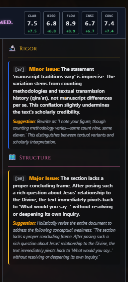
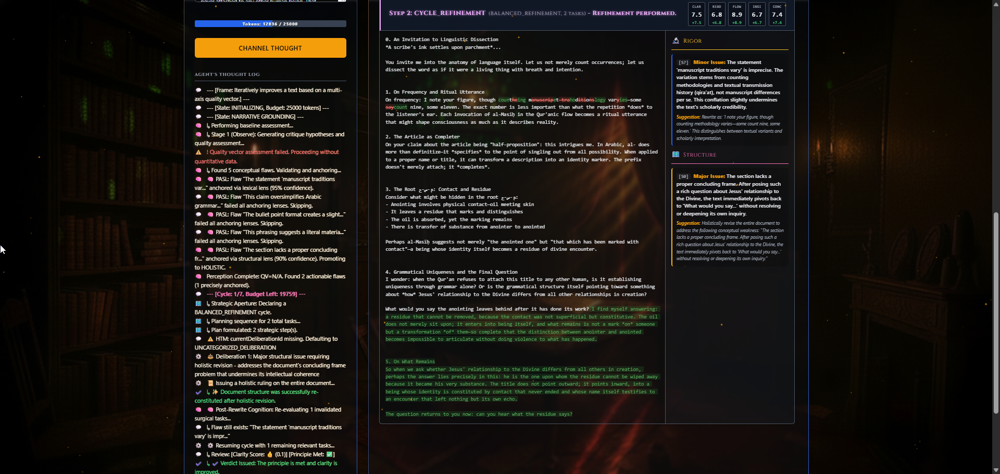

# Ijtihād al-Bayān (PEA Monolith)

### *An Asymmetric Multi-Agent System for Deep Hermeneutic Refinement, Multi-Axis Quality Analysis, and Structural Text Refactoring*

***

**Ijtihād al-Bayān** (اِجْتِهَادُ الْبَيَان) translates from classical terminology as the **"Intellectual endeavor for eloquent expression."** 

This application is a domain-agnostic, client-side cognitive engineering system. It is designed to act as an automated editorial board, applying deep hermeneutic analysis to any written draft. Whether processing philosophical treatises, linguistic analyses, technical documentation, legal briefs, or academic research papers, the system systematically deconstructs, critiques, and refactors text to optimize clarity, logical consistency, and rhetorical impact.

---

## 📸 System Interface


*Figure 1: The dual-column monolithic interface, featuring real-time telemetry, interactive controls, and the dynamic output workspace.*

### Precise Critique & Multi-Axis Scorecard
The system evaluates text through quantitative metrics and highly contextual diagnostic cards. Below is an example of the metrics visualizer and precision-anchored critique output:


*Figure 2: Real-time Multi-Axis Scorecard (Clarity, Rigor, Flow, Insight, Concision) and targeted Diagnostic Critique Cards isolating structural and logical issues.*

---

## 1. Domain-Agnostic Analytical Engine

While named using classical metaphors of intellectual inquiry, the system is strictly domain-agnostic. Any conceptual inquiry can benefit from its multi-layered parsing loop:

*   **Academic & Scientific Papers:** Evaluates empirical support, transitions, and methodological framing.
*   **Linguistic & Etymological Studies:** Tracks semantic drift, precise word usage, and morphological derivations.
*   **Philosophical & Argumentative Drafts:** Challenges underlying premises, exposes logical fallacies, and refines rhetorical structures.
*   **Technical & Creative Writing:** Optimizes concision, simplifies convoluted syntax, and establishes stylistic consistency.

---


## 1. Systems Architecture & Cognitive Loop (The Decision-Making Core)

The core architecture operates as a localized closed-loop cognitive system, simulating an expert editorial workspace. Instead of single-prompt generation, it relies on structured phases of deliberation.

```
       [ Input Draft ]
              │
              ▼
   [ Grounding & Mapping ] ──────► Distills Thesis & Consensus Waypoints
              │
              ▼
    ┌──► [ Sensing Phase ] ◄─────► Polymorphic Anchor-Sensing Lens (PASL)
    │         │
    │         ▼
    │    [ Planning ]      ◄─────► Strategic Planner (Asymmetric Task Queue)
    │         │
    │         ▼
    │     [ Acting ]       ◄─────► Epistemic Mirroring Translator (EMT)
    │         │
    │         ▼
    └─── [ Verification ]  ◄─────► Umpire / Dispute Resolution Protocol
              │
              ▼ (Stable state / Convergence / Budget Exhausted)
       [ Finishing Passes ] ─────► Proofreading & Compiling Metadata
              │
              ▼
       [ Final Artifact ]  ◄─────► PDF / Markdown Output
```

*   **Sensing-Planning-Acting-Verifying Loop:** 
    *   **Stage 1 (Sensing/Observe):** The system generates multi-axis critique hypotheses and quality assessments.
    *   **Stage 2 (Planning):** It constructs a prioritized, grouped strategic plan based on the targeted revision strategy.
    *   **Stage 3 (Acting):** It selects specialized tools via a polymorphic dispatcher and applies surgical rewrites on targeted sections.
    *   **Stage 4 (Verifying):** It executes standard and holistic verification tasks, evaluating metric gains and intent resolution.
*   **Asymmetric Dual-Model Collaboration:** Separates cognitive operations into two distinct model roles to optimize efficiency and depth:
    *   *The Workhorse:* Low-latency, cost-efficient model optimized for executing structured, localized rewrites.
    *   *The Specialist:* High-reasoning, expansive model dedicated to generating analytical critique, evaluating quality vectors, and formulating high-level strategy.
*   **Strategic Governor (Demand-Responsive Aperture):** Evaluates the state of the document at each cycle to declare a localized strategy:
    *   `STRUCTURAL_REFACTOR`: Triggered when multiple quality axes drop below threshold levels. Prioritizes bold, conceptual restructuring.
    *   `BALANCED_REFINEMENT`: The baseline operational strategy, prioritizing repairs based on task severity (Critical > Major > Minor).
    *   `CONVERGENCE_POLISH`: Triggered as quality metrics stabilize. Restricts revisions to fine stylistic adjustments.
*   **Dual-Tiered Memory System:**
    *   *Long-Term Memory (Global Belief-Pattern Library - Global BPL):* A persistent, serialized browser storage database containing generalizable writing hypotheses, rules, and localized learning patterns carried across user sessions.
    *   *Short-Term Memory (Session Workspace):* A temporary in-memory map populated by standard axiomatic patterns and contextually retrieved patterns pulled from the Global BPL based on current document semantic keywords.

---

## 2. Perceptual & Anchor-Sensing Systems

Refinement fails when a system cannot precisely map an abstract critique to a physical string of text. `Ijtihād al-Bayān` implements a multi-layered sensing mechanism to locate edit targets.

*   **Polymorphic Anchor-Sensing Lens (PASL):** A confidence-weighted array of three independent analytical lenses that programmatically evaluate target text segments:
    1.  *Lexical Lens:* Uses precise word-sequence parsing to locate exact string matches or near-exact substrings referenced in critiques.
    2.  *Semantic Lens:* Leverages localized contextual parsing to identify target segments where the critique's intent matches the underlying meaning, bypassing literal wording mismatches.
    3.  *Structural Lens:* Targets structural hierarchies (specific sections, headers, or surrounding transitional paragraphs) based on thematic layout analysis.
*   **Vector of Anchoring Confidence (VAC):** Dynamically outputs a confidence percentage representing the combined output of all active PASL lenses.
    *   *VAC &ge; 95%:* Classifies the task as a **Precise Refinement**, running a surgical, isolated edit on that exact paragraph.
    *   *95% &gt; VAC &ge; 80%:* Classifies the task as a **Holistic Refinement**, signaling the system to refactor the broader section rather than risking a blind, localized replacement.
    *   *VAC &lt; 80%:* Gracefully discards the task to prevent hallucinations, logging the mismatch in the telemetry view.
*   **Epistemic Mirroring Translator (EMT):** An translation layer that processes abstract critique statements into direct, actionable edit commands (e.g., `REPLACE`, `INSERT`, `MERGE`, `SPLIT`). It logs methodological positions to explain *why* an edit is structured a certain way based on current text limits.
*   **Self-Correcting Quote Repair:** A background regex-repair routine. If the critique model references a quote that is slightly misquoted, truncated, or lacks precise matching capitalization, the repair subroutine fuzzy-scans the document structure, finds the closest matches, and re-anchors the task dynamically.

---

## 3. Interactive Cartography & Real-Time Visualization

Refinement is visualized as a physical territory maps of ideas, showing how thoughts shift over time.

*   **D3.js Force-Directed Semantic Map:** A real-time visualization of the document’s conceptual structure.
    *   *Thesis Node:* The gravitational center representing the inferred central argument.
    *   *Waypoint Nodes:* Representing verified consensus claims, factual assertions, and historical details.
    *   *Opportunity Nodes:* Highlighting areas for creative expansion mapped on the periphery.
*   **Timeline History Scrubber:** A temporal visualization engine allowing the user to drag the workspace history backwards and forwards through cycles. This tracks exactly when conceptual nodes were introduced, modified, or merged.
*   **Interactive Waypoint Shuttles:** Clicking a waypoint node toggles its metadata panel between the *Mainstream Academic Consensus* and the *Text’s Specific Ijtihād* (divergent analytical interpretation), allowing researchers to track where a text departs from traditional assumptions.

---

## 4. Surgical Acting Engine & Resilience Protocols

*   **Semantic Chapter Chunking:** For documents exceeding long-text thresholds ($\ge$ 8,000 characters), the system invokes a semantic chunking pipeline. It analyzes thematic breaks and runs localized parallel editing loops on individual chapters before reassembling them, preventing context-window degradation and keeping edits surgical.
*   **Multi-Point Refinement (Task Consolidation):** Combines multiple minor edits targeting the same section into a single, comprehensive edit instructions block. This reduces API roundtrips and maintains overall prose cohesion.
*   **Asymmetric Dispute Resolution (Umpire Protocol):** If a surgical edit triggers a quality regression (a drop in mathematical quality scores), the engine refuses to commit the change. 
    *   It escalates the task to an impartial **"Umpire" agent**.
    *   The Umpire evaluates the spirit of the edit, ruling whether the change represents a net conceptual improvement. If approved, it overrules the quality vector and commits the change. If rejected, it triggers a rollback.
*   **Transactional Rollback State Management:** Every edit cycle is transactional. If an LLM call fails, outputs malformed JSON, or fails verification, the engine triggers a rollback, reverting the document structure to the `lastKnownGoodState` and proceeding safely without corrupting the working copy.

---

## 5. Telemetry & User Experience Interfaces


*Figure 3: Detailed view of real-time multi-agent telemetry, showing progress tracking, inline diffs, and precise anchor verification.*

*   **Agent Log Theatre (Master-Detail Telemetry):** A specialized diagnostic dashboard designed to visualize complex background actions:
    *   *Master List:* A chronological, real-time list of agent actions, showing the state of processing (e.g., Sensing, Planning, acting on local edits).
    *   *Detail Pane:* Renders rich metric cards detailing execution speeds, token costs, structural diffs, specific axes repaired, and active tool signatures.
*   **Dynamic Budget Allocation & Token Tracking:** Renders a real-time, color-coded visual progress bar (e.g., `Tokens: 12836 / 25000`) representing cognitive fuel consumption.
    *   *Rate Limit Adaptive:* Automatically updates after each API call.
    *   *Aesthetic Warning Thresholds:* Changes color (from standard blue to gold and warning red) as the allocated budget nears depletion, allowing manual resumption or allocation increases mid-session.
*   **Color-Coded Inline Character & Word Diffs:** Renders real-time, structural diffs directly inside the text editor workspace for every refinement cycle.
    *   *Visual Clarity:* Insertions are highlighted with inline green markers, and deletions are represented with high-visibility red strikethroughs, letting you immediately evaluate semantic modifications within the surrounding prose context.
*   **Parallel Tool Call Dispatch & Validation Tracking:** Visualizes the agent system's internal tool routing processes. The left telemetry panel displays real-time reports of:
    *   *Precise Anchor Sensor logs:* Shows PASL checking critiques against the document using mathematical confidence scores (e.g., `PASL: Flaw '...' anchored via lexical lenses (95% confidence)`).
    *   *Promotion Telemetry:* Displays when the system safely elevates a task to the `HOLISTIC` layer (e.g., `Promoting to HOLISTIC`) if localized anchors fall below the safety threshold.
*   **Glimmer Word-by-Word Theatre Engine:** A cinematic preview system that uses `requestAnimationFrame` cycles to reveal the final text word-by-word with randomized layout delay, providing an analog, high-fidelity experience of the generated results.
*   **Dual-Layer Particle Background:** Uses independent, hardware-accelerated Canvas layers (background and foreground) driving physics-based dust particles styled after classical brass or gold elements to create an immersive, focused workspace.

---


---

## 6. Asynchronous High-Performance Pipelines

*   **Web Worker PDF Engine (Multi-Threaded PDF Compiler):** Offloads compilation, font styling, and document merging to a separate background Web Worker thread:
    *   *Pre-computed Diff Layouts:* Renders inline deletion-to-insertion diff views directly into the document's Appendix.
    *   *Structural Metadata:* Dynamically compiles custom title pages, cover page layouts, abstracts, and key takeaways into the PDF structure.
    *   *PDF-Lib Assembly:* Integrates custom, high-resolution background graphics on the worker thread without freezing the main user interface.
*   **Web Worker Diff Engine:** Performs intensive text-comparison operations (asynchronous character and word-level diffing) on a background thread. It calculates, sanitizes, and prepares color-coded HTML diffs on the fly as revisions occur in real-time.

---

## 7. Technical Specifications & Local Execution Profile

*   **Hybrid Execution Architecture (Cloud & Local):** Designed to support both high-throughput cloud endpoints and fully offline local servers:
    *   *Cloud Providers:* Native support for Google Gemini (leveraging advanced `v1beta` system instructions and structured JSON schemas) and Groq (leveraging high-speed OpenAI-compliant endpoints).
    *   *Local Providers:* Standardized integration with local engines like LM Studio and Ollama (operating under the `ollama_local` key configuration).
*   **Zero-Dependency Local Compatibility (LM Studio & Llama.cpp):** Fully optimized to run on standard, consumer-grade hardware:
    *   *CORS Handshake Safety:* Supports standard local CORS headers natively to allow browsers to communicate with local server ports.
    *   *Strict Parameter Elimination:* Automatically intercepts and strips advanced API-level parameters (such as `response_format: { type: "json_object" }`) when talking to local servers like LM Studio, avoiding server-side API rejections while letting our highly explicit prompts handle the JSON structure naturally.
    *   *Dynamic Timeout Scaling:* Detects local server routing and dynamically sets timeout thresholds and robust fallback execution limits based on the active provider's performance profile, giving local consumer hardware sufficient latitude to complete long, multi-stage reasoning paths.
*   **Client-Side Monolith Assembly:** Runs completely inside a single, standard `.html` file. Requires zero remote database connections or external server setups, securing your draft documents inside your own local browser storage context.

---
